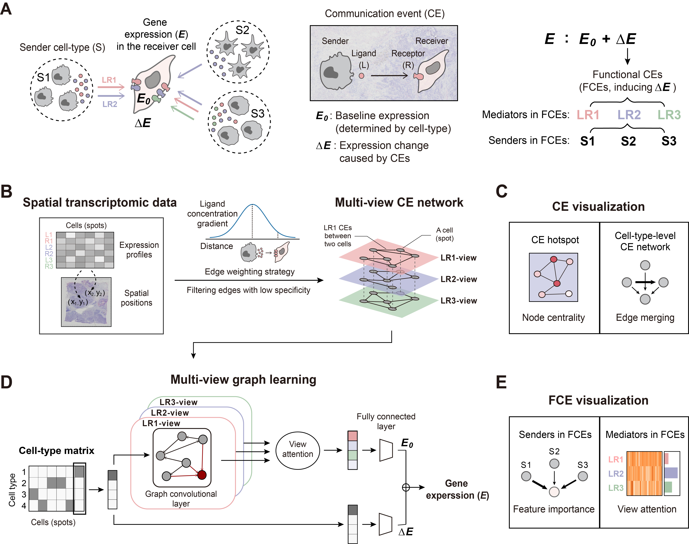

HoloNet: Decoding functional cell–cell communication events by multi-view graph learning on spatial transcriptomics
====================================================================================================
|docs| |pypi|

.. |docs| image:: https://readthedocs.org/projects/holonet-doc/badge/?version=latest
    :target: https://holonet-doc.readthedocs.io/en/latest/?badge=latest
    :alt: Documentation Status
    
.. |pypi| image:: https://img.shields.io/pypi/v/HoloNet
    :target: https://pypi.org/project/HoloNet/
    :alt: PyPI

HoloNet is a powerful tool on spatial transcriptomic data to help understand the shaping of cellular phenotypes through cell–cell communications in a microenvironment. HoloNet plays nicely with `scanpy <https://scanpy.readthedocs.io/en/stable/index.html>`_.

Cell–cell communication events (CEs) mediated by multiple ligand–receptor pairs construct a complex intercellular signaling network. Usually only a subset of CEs directly works for a specific downstream response in certain microenvironment. We call them as the functional communication events (FCEs). Spatial transcriptomic methods can profile the spatial distribution of gene expression levels of ligands, receptors and their downstream genes. This provides a new possibility for revealing the panorama of cell–cell communications. We developed a computational method HoloNet for decoding FCEs using spatial transcriptomic data. We modeled CEs as a multi-view network, developed an attention-based graph learning model on the network to predict the target gene expression, and decode the FCEs for specific downstream genes by interpreting the trained model.

Installation
^^^^^^^^^^^^
You need to have Python 3.8 or newer installed on your system.

The latest release of `HoloNet` can be installed from `PyPI <https://pypi.org/project/infercnvpy/>`_:

.. code-block::
        
        pip install HoloNet

Getting started
^^^^^^^^^^^^^^^
Please refer to the `Documentation <https://holonet-doc.readthedocs.io/en/latest/>`_, including:

- `Tutorials <https://holonet-doc.readthedocs.io/en/latest/>`_
- `API <https://holonet-doc.readthedocs.io/en/latest/api.html>`_

Citation
^^^^^^^^^^^^^^^

