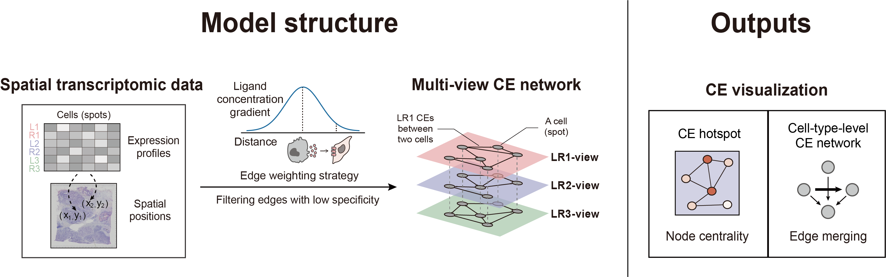
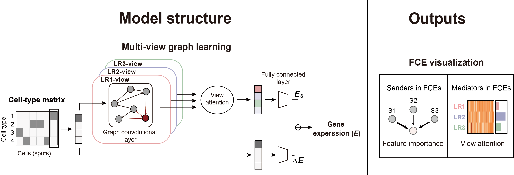

Tutorials
===========

.. toctree::
   :maxdepth: 1
   :caption: Contents:

   tutorial_folder/tutorial_CE
   tutorial_folder/tutorial_FCE
   

The first tutorial mainly for analyzing and visualizing cell-cell communication events (CEs), corresponding to the first part of HoloNet:

The second tutorial mainly for decoding the holograph of functional cell-cell communication events (FCEs),
corresponding to the second part of HoloNet:

