Tutorial
==========

.. code:: ipython3

    import HoloNet as hn
    
    import os
    import pandas as pd
    import numpy as np
    import scanpy as sc
    import matplotlib.pyplot as plt
    import torch
    
    import warnings
    warnings.filterwarnings('ignore')
    hn.set_figure_params(tex_fonts=True)
    sc.settings.figdir = './figure/'

Load data
---------

.. code:: ipython3

    adata = sc.read_h5ad('./data/BRCA_Visium_10x_0504.h5ad')
    sc.pl.spatial(adata, color=['cell_type'], size=1.4, alpha=0.7,
                 palette=hn.brca_default_color_celltype)

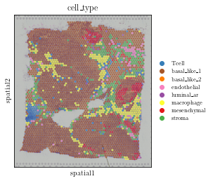

.. code:: ipython3

    LR_pair_database_PATH = os.path.join('./data/ConnectomeDB2020.csv')
    
    connectomeDB = pd.read_csv(LR_pair_database_PATH,encoding='Windows-1252')
    used_connectomeDB = connectomeDB.loc[:,['Ligand gene symbol','Receptor gene symbol','Ligand location']]
    used_connectomeDB.columns = ['Ligand_gene_symbol','Receptor_gene_symbol','Ligand_location']
    
    expressed_LR_df = hn.pp.get_expressed_lr_df(used_connectomeDB,adata,expressed_proportion=0.3)
    expressed_LR_df.head(3)

.. raw:: html

    

    
    <table border="1" class="dataframe">
      <thead>
        <tr style="text-align: right;">
          <th></th>
          <th>Ligand_gene_symbol</th>
          <th>Receptor_gene_symbol</th>
          <th>Ligand_location</th>
          <th>LR_Pair</th>
        </tr>
      </thead>
      <tbody>
        <tr>
          <th>0</th>
          <td>A2M</td>
          <td>LRP1</td>
          <td>secreted</td>
          <td>A2M:LRP1</td>
        </tr>
        <tr>
          <th>1</th>
          <td>ADAM15</td>
          <td>ITGA5</td>
          <td>plasma membrane</td>
          <td>ADAM15:ITGA5</td>
        </tr>
        <tr>
          <th>2</th>
          <td>ADAM15</td>
          <td>ITGAV</td>
          <td>plasma membrane</td>
          <td>ADAM15:ITGAV</td>
        </tr>
      </tbody>
    </table>
    

Construct CE network
---------

.. code:: ipython3

    w_best = hn.tl.default_w_visium(adata)
    hn.pl.select_w(adata, w_best=w_best)

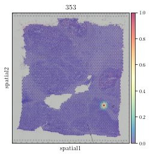

.. code:: ipython3

    CE_tensor = hn.tl.compute_ce_tensor(adata=adata, lr_df=expressed_LR_df, w_best=w_best)
    CE_tensor_filtered = hn.tl.filter_ce_tensor(ce_tensor=CE_tensor, adata=adata, 
                                                lr_df=expressed_LR_df,w_best=w_best)

.. parsed-literal::

    100%|██████████| 286/286 [38:00<00:00,  7.97s/it]

Visualize CE network
---------

.. code:: ipython3

    X, cell_type_names = hn.pr.get_continuous_cell_type_tensor(adata, continuous_cell_type_slot = 'predicted_cell_type',)

.. code:: ipython3

    _ = hn.pl.ce_hotspot_plot(CE_tensor_filtered, adata, expressed_LR_df, 'COL1A1:DDR1')

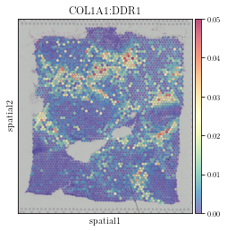

.. code:: ipython3

    _ = hn.pl.ce_cell_type_network_plot(ce_tensor=CE_tensor_filtered, cell_type_tensor=X, 
                                        cell_type_names=cell_type_names,
                                        lr_df=expressed_LR_df, plot_lr='COL1A1:DDR1', edge_thres=0.2,
                                        palette=hn.brca_default_color_celltype)

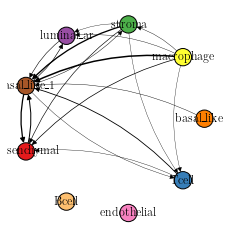

.. code:: ipython3

    cell_cci_centrality = hn.tl.compute_ce_network_eigenvector_centrality(CE_tensor_filtered)
    clustered_expressed_LR_df = hn.tl.cluster_lr_based_on_ce(CE_tensor_filtered, adata, expressed_LR_df, 
                                                             w_best=w_best, cell_cci_centrality=cell_cci_centrality)

.. code:: ipython3

    hn.pl.lr_umap(clustered_expressed_LR_df, cell_cci_centrality, plot_lr_list=['COL1A1:DDR1'], linewidths=0.7)

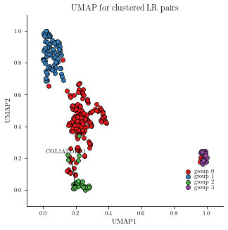

Predict target gene expression with GNN
---------

.. code:: ipython3

    adj = hn.pr.adj_normalize(adj=CE_tensor_filtered, cell_type_tensor=X, only_between_cell_type=True)

.. code:: ipython3

    target_all_gene_expr, used_gene_list = hn.pr.get_gene_expr(adata, expressed_LR_df)
    target = hn.pr.get_one_case_expr(target_all_gene_expr, cases_list=used_gene_list, used_case_name='MMP11')
    sc.pl.spatial(adata, color=['MMP11'], cmap='Spectral_r', size=1.4, alpha=0.7)

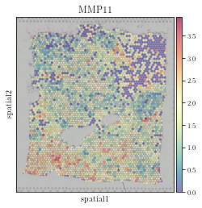

.. code:: ipython3

    trained_MGC_model_MMP11_list = hn.pr.mgc_repeat_training(X, adj, target, device='gpu',)
    predict_result_MMP11 = hn.pl.plot_mgc_result(trained_MGC_model_MMP11_list, adata, X, adj)
    np.corrcoef(predict_result_MMP11.T, target.T)

.. parsed-literal::

    100%|██████████| 50/50 [01:42<00:00,  2.05s/it]
    100%|██████████| 50/50 [00:00<00:00, 87.11it/s]

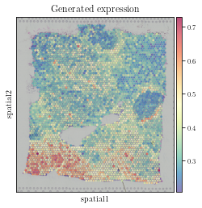

.. parsed-literal::

    array([[1.        , 0.54181371],
           [0.54181371, 1.        ]])

Visualize FCE network
---------

.. code:: ipython3

    related_LR_df_GCN_result = hn.pl.lr_rank_in_mgc(trained_MGC_model_MMP11_list, expressed_LR_df, 
                                                    plot_cluster=False, repeat_attention_scale=True)

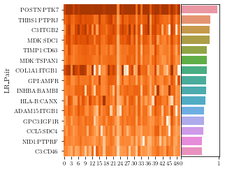

.. code:: ipython3

    tmp_df = hn.pl.delta_e_proportion(trained_MGC_model_MMP11_list, X, adj,
                                      cell_type_names,
                                      palette = hn.brca_default_color_celltype)

.. parsed-literal::

    100%|██████████| 50/50 [00:15<00:00,  3.17it/s]

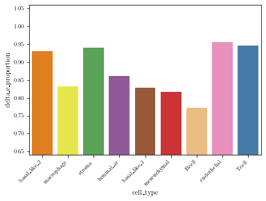

.. code:: ipython3

    _ = hn.pl.fce_cell_type_network_plot(trained_MGC_model_MMP11_list, expressed_LR_df, X, adj, 
                                         cell_type_names, plot_lr='POSTN:PTK7', edge_thres=0.1,
                                         palette=hn.brca_default_color_celltype)

.. parsed-literal::

    100%|██████████| 50/50 [00:00<00:00, 709.27it/s]

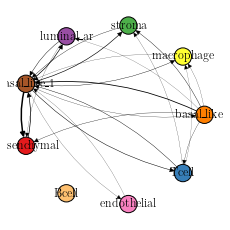

Identify genes affected more by CCI
--------------------------------

.. code:: ipython3

    trained_MGC_model_only_type_list_raw, \
    trained_MGC_model_type_GCN_list_raw = hn.pr.mgc_training_for_multiple_targets(X, adj, target_all_gene_expr, device='gpu')

.. parsed-literal::

    100%|██████████| 567/567 [2:15:28<00:00, 14.34s/it]  

.. code:: ipython3

    predicted_expr_type_GCN_df_raw = hn.pr.get_mgc_result_for_multiple_targets(trained_MGC_model_type_GCN_list_raw, X, adj,
                                                                               used_gene_list, adata)
    predicted_expr_only_type_df_raw = hn.pr.get_mgc_result_for_multiple_targets(trained_MGC_model_only_type_list_raw, X, adj,
                                                                                used_gene_list, adata)

.. parsed-literal::

     63%|██████▎   | 358/567 [02:16<01:15,  2.79it/s]

.. code:: ipython3

    only_type_vs_GCN_all_raw = hn.pl.find_genes_linked_to_ce(predicted_expr_type_GCN_df_raw, predicted_expr_only_type_df_raw, 
                                                         used_gene_list, target_all_gene_expr, 
                                                         plot_gene_list = ['MMP11'], linewidths=0.5)

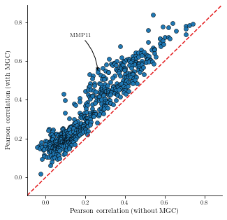

