Cell-cell communication analysis and visualization
=====================

In this tutorial, we demonstrate how HoloNet can be used to analyze and visualize cell-cell communication
in spatial transcriptomics data.

.. note::
    HoloNet needs three inputs:

    1. Spatial transcriptomic data (with gene expression matrix and spatial information).
        - In this version of HoloNet, we support the spatial data based on :class:`~anndata.AnnData` loaded from Scanpy.
    #. Cell-type information.
        - Cell-type percentages from deconvolution methods prefer to be saved in ``adata.obsm['predicted_cell_type']``.
        - Categorical cell-type labels prefer to be saved in ``adata.obs['cell_type']``.
    #. Database with pairwise ligand and receptor genes.
        - A pandas dataframe, must contain two columns: 'Ligand_gene_symbol' and 'Receptor_gene_symbol'.

The tutorial mainly follows these steps:

1. Load spatial transcriptomic data.
#. Construct multi-view communication network among single cells (each LR pair corresponds to one view).
#. Visualize communication based on the multi-view network.
#. Other analysis methods (such as clustering LR pairs).

.. code:: python

    import HoloNet as hn
    
    import os
    import pandas as pd
    import numpy as np
    import scanpy as sc
    import matplotlib.pyplot as plt
    import torch
    
    import warnings
    warnings.filterwarnings('ignore')
    hn.set_figure_params(tex_fonts=False)
    sc.settings.figdir = './figures/'

Loading the example dataset
^^^^^^^^^^^^^^^^^^^^^^^^^^^^^

We prepare a example breast cancer dataset for users from the 10x Genomics website.
We preprocessed the dataset, including filtering, normalization and cell-type annotation.
Users can load the example dataset via :func:`HoloNet.pp.load_brca_visium_10x`.

.. code:: python

    adata = hn.pp.load_brca_visium_10x()

Visualize the cell-type percentages in each spot.

.. code:: python

    hn.pl.plot_cell_type_proportion(adata, plot_cell_type='stroma')

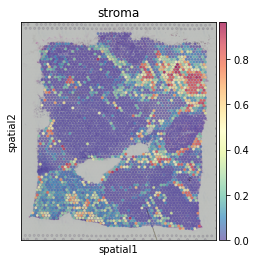

The cell-type label of each spot (the cell-type with maximum percentage in the spot)

.. code:: python

    sc.pl.spatial(adata, color=['cell_type'], size=1.4, alpha=0.7,
                 palette=hn.brca_default_color_celltype)

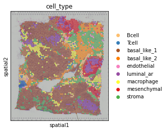

We prepare a database with pairwise ligand and receptor genes for users.
Load the database and filter the LR pairs, requiring both ligand and receptor genes to be expressed
in a certain percentage of cells (or spots).

.. code:: python

    LR_df = hn.pp.load_lr_df()
    expressed_LR_df = hn.pp.get_expressed_lr_df(LR_df, adata, expressed_proportion=0.3)
    expressed_LR_df.head(3)

.. raw:: html

    

    
    <table border="1" class="dataframe">
      <thead>
        <tr style="text-align: right;">
          <th></th>
          <th>Ligand_gene_symbol</th>
          <th>Receptor_gene_symbol</th>
          <th>Ligand_location</th>
          <th>LR_Pair</th>
        </tr>
      </thead>
      <tbody>
        <tr>
          <th>0</th>
          <td>A2M</td>
          <td>LRP1</td>
          <td>secreted</td>
          <td>A2M:LRP1</td>
        </tr>
        <tr>
          <th>1</th>
          <td>ADAM15</td>
          <td>ITGA5</td>
          <td>plasma membrane</td>
          <td>ADAM15:ITGA5</td>
        </tr>
        <tr>
          <th>2</th>
          <td>ADAM15</td>
          <td>ITGAV</td>
          <td>plasma membrane</td>
          <td>ADAM15:ITGAV</td>
        </tr>
      </tbody>
    </table>
    

Constructing multi-view communication network
^^^^^^^^^^^^^^^^^^^^^^^^^^^^^^^^^^^^^^^^^^^^^^^^^^^^

Ligand molecules from a single source can only cover a certain region.
Before constructing multi-view communication network, we need to calculate the ``w_best`` to decide the region ('how far is far').

.. code:: python

    w_best = hn.tl.default_w_visium(adata)
    hn.pl.select_w(adata, w_best=w_best)

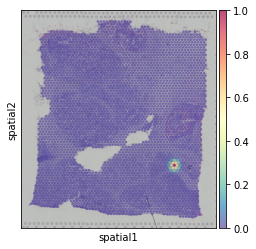

.. note::
   Though we highly recommend using BRIE v2 for a coherent way for splicing
   phenotype selection, `BRIE1 CLI`_ (MCMC based & gene feature only)
   is still available but the CLIs are changed to `brie1` and `brie1-diff`.

.. code:: python

    CE_tensor = hn.tl.compute_ce_tensor(adata, lr_df=expressed_LR_df, w_best=w_best)
    CE_tensor_filtered = hn.tl.filter_ce_tensor(CE_tensor, adata, 
                                                lr_df=expressed_LR_df, w_best=w_best)
.. parsed-literal::

    100%|██████████| 286/286 [35:28<00:00,  7.44s/it]

.. code:: python

    cell_type_mat, \
    cell_type_names = hn.pr.get_continuous_cell_type_tensor(adata, continuous_cell_type_slot = 'predicted_cell_type',)

.. code:: python

    hn.pl.ce_hotspot_plot(CE_tensor_filtered, adata, 
                          lr_df=expressed_LR_df, plot_lr='COL1A1:DDR1')

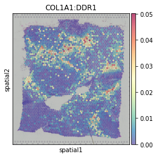

.. code:: python

    hn.pl.ce_hotspot_plot(CE_tensor_filtered, adata, 
                          lr_df=expressed_LR_df, plot_lr='COL1A1:DDR1',
                          centrality_measure='eigenvector')

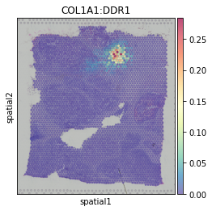

.. code:: python

    _ = hn.pl.ce_cell_type_network_plot(CE_tensor_filtered, cell_type_mat, cell_type_names,
                                        lr_df=expressed_LR_df, plot_lr='COL1A1:DDR1', edge_thres=0.2,
                                        palette=hn.brca_default_color_celltype)

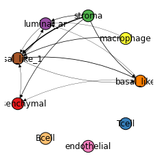

.. code:: python

    cell_cci_centrality = hn.tl.compute_ce_network_eigenvector_centrality(CE_tensor_filtered)
    clustered_expressed_LR_df = hn.tl.cluster_lr_based_on_ce(CE_tensor_filtered, adata, expressed_LR_df, 
                                                             w_best=w_best, cell_cci_centrality=cell_cci_centrality)

.. code:: python

    hn.pl.lr_umap(clustered_expressed_LR_df, cell_cci_centrality, plot_lr_list=['COL1A1:DDR1'], linewidths=0.7)

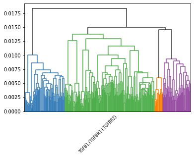

.. code:: python

    hn.pl.lr_cluster_ce_hotspot_plot(lr_df=clustered_expressed_LR_df,
                                     cell_cci_centrality=cell_cci_centrality,
                                     adata=adata)

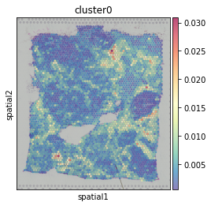

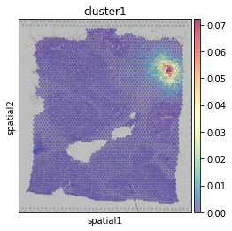

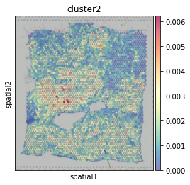

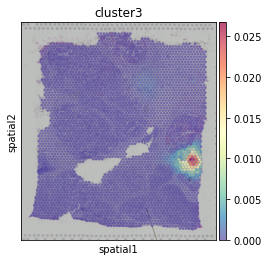

