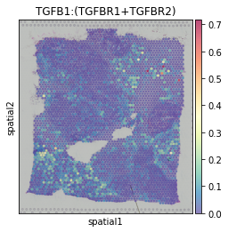

Analyzing and visualizing cell-cell communication events
========================================================

In this tutorial, we demonstrate how HoloNet can be used to analyze and visualize cell-cell communication
in spatial transcriptomics data.

HoloNet needs three inputs:

1. Spatial transcriptomic data (with gene expression matrix and spatial information).
    - In this version of HoloNet, we support the spatial data based on :class:`~anndata.AnnData` loaded from Scanpy.
#. Cell-type information.
    - Cell-type percentages from deconvolution methods prefer to be saved in ``adata.obsm['predicted_cell_type']``.
    - Categorical cell-type labels prefer to be saved in ``adata.obs['cell_type']``.
#. Database with pairwise ligand and receptor genes.
    - A pandas dataframe, must contain two columns: 'Ligand_gene_symbol' and 'Receptor_gene_symbol'.

.. note::
    The tutorial mainly follows these steps:

    1. Load spatial transcriptomic data.
    #. Construct multi-view communication event (CE) network among single cells (each LR pair corresponds to one view).
    #. Visualize communication based on the multi-view network.
    #. Other analysis methods (such as clustering LR pairs).

.. code:: ipython3

    import HoloNet as hn
    
    import os
    import pandas as pd
    import numpy as np
    import scanpy as sc
    import matplotlib.pyplot as plt
    import torch
    
    import warnings
    warnings.filterwarnings('ignore')
    hn.set_figure_params(tex_fonts=False)
    sc.settings.figdir = './figures/'

Data loading
^^^^^^^^^^^^^^^^^^^^^^^^^^^^^

Loading example spatial transcriptomic data
-----------------------------------------------

We prepare a example breast cancer dataset for users from the 10x Genomics website.
We preprocessed the dataset, including filtering, normalization and cell-type annotation.
Users can load the example dataset via :func:`HoloNet.preprocessing.load_brca_visium_10x`.

.. code:: ipython3

    adata = hn.pp.load_brca_visium_10x()

Visualize the cell-type percentages in each spot.

.. code:: ipython3

    hn.pl.plot_cell_type_proportion(adata, plot_cell_type='stroma')

.. image:: tutorial_CE_files/tutorial_CE_3_0.png

The figures outputed from HoloNet can be saved if adding ``fname`` parameter.

.. note::
    The parameters of plotting functions in this tutorials are mainly inherited from two base plotting functions:

    - :func:`HoloNet.plotting.feature_plot`
    - :func:`HoloNet.plotting.cell_type_level_network`

The cell-type label of each spot (the cell-type with maximum percentage in the spot)

.. code:: ipython3

    sc.pl.spatial(adata, color=['cell_type'], size=1.4, alpha=0.7,
                 palette=hn.brca_default_color_celltype)

.. image:: tutorial_CE_files/tutorial_CE_2_0.png

Loading ligand-receptor database
-----------------------------------------------

We provide a database with pairwise ligand and receptor genes for users.
Load the database and filter the LR pairs, requiring both ligand and receptor genes to be expressed
in a certain percentage of cells (or spots).

.. code:: ipython3

    interaction_db, cofactor_db, complex_db = hn.pp.load_lr_df(human_or_mouse='human')
    expressed_lr_df = hn.pp.get_expressed_lr_df(interaction_db, complex_db, adata)
    expressed_lr_df.shape

.. parsed-literal::

    (325, 12)

We also allow access to ligand-receptor pair databases based on the MITAB canonicalized nomenclature.
We provide samples here so that users can import MITAB-compliant ligand-receptor databases and replace ``interaction_db``

.. code:: ipython3

    pd.set_option('display.max_columns', None)
    interaction_db_MITAB = pd.read_csv('cellchatdb_human_interaction_example_with_MITAB.csv', index_col=0)
    interaction_db_MITAB.head()

.. raw:: html

    

    
    <table border="1" class="dataframe">
      <thead>
        <tr style="text-align: right;">
          <th></th>
          <th>interaction_name</th>
          <th>pathway_name</th>
          <th>ligand</th>
          <th>receptor</th>
          <th>agonist</th>
          <th>antagonist</th>
          <th>co_A_receptor</th>
          <th>co_I_receptor</th>
          <th>evidence</th>
          <th>annotation</th>
          <th>interaction_name_2</th>
          <th>LR_pair</th>
          <th>#ID Interactor A</th>
          <th>ID Interactor B</th>
          <th>Alt IDs Interactor A</th>
          <th>Alt IDs Interactor B</th>
          <th>Aliases Interactor A</th>
          <th>Aliases Interactor B</th>
          <th>Interaction Detection Method</th>
          <th>Publication 1st Author</th>
          <th>Publication Identifiers</th>
          <th>Taxid Interactor A</th>
          <th>Taxid Interactor B</th>
          <th>Interaction Types</th>
          <th>Source Database</th>
          <th>Interaction Identifiers</th>
          <th>Confidence Values</th>
        </tr>
      </thead>
      <tbody>
        <tr>
          <th>0</th>
          <td>TGFA_EGFR</td>
          <td>EGF</td>
          <td>TGFA</td>
          <td>EGFR</td>
          <td>NaN</td>
          <td>NaN</td>
          <td>NaN</td>
          <td>NaN</td>
          <td>KEGG: hsa04012</td>
          <td>Secreted Signaling</td>
          <td>TGFA - EGFR</td>
          <td>TGFA:EGFR</td>
          <td>entrez gene/locuslink:1956</td>
          <td>entrez gene/locuslink:7039</td>
          <td>biogrid:108276|entrez gene/locuslink:EGFR|unip...</td>
          <td>biogrid:112897|entrez gene/locuslink:TGFA|unip...</td>
          <td>entrez gene/locuslink:ERBB(gene name synonym)|...</td>
          <td>entrez gene/locuslink:TFGA(gene name synonym)</td>
          <td>psi-mi:"MI:0018"(two hybrid)</td>
          <td>Kotlyar M (2015)</td>
          <td>pubmed:25402006</td>
          <td>taxid:9606</td>
          <td>taxid:9606</td>
          <td>psi-mi:"MI:0407"(direct interaction)</td>
          <td>psi-mi:"MI:0463"(biogrid)</td>
          <td>biogrid:1067440</td>
          <td>-</td>
        </tr>
        <tr>
          <th>1</th>
          <td>OSM_OSMR_IL6ST</td>
          <td>OSM</td>
          <td>OSM</td>
          <td>OSMR_IL6ST</td>
          <td>NaN</td>
          <td>NaN</td>
          <td>NaN</td>
          <td>NaN</td>
          <td>KEGG: hsa04060</td>
          <td>Secreted Signaling</td>
          <td>OSM - (OSMR+IL6ST)</td>
          <td>OSM:OSMR_IL6ST</td>
          <td>entrez gene/locuslink:5008</td>
          <td>entrez gene/locuslink:3572</td>
          <td>biogrid:111049|entrez gene/locuslink:OSM|unipr...</td>
          <td>biogrid:109786|entrez gene/locuslink:IL6ST|uni...</td>
          <td>-</td>
          <td>entrez gene/locuslink:CD130(gene name synonym)...</td>
          <td>psi-mi:"MI:0004"(affinity chromatography techn...</td>
          <td>Huttlin EL (2015)</td>
          <td>pubmed:26186194</td>
          <td>taxid:9606</td>
          <td>taxid:9606</td>
          <td>psi-mi:"MI:0915"(physical association)</td>
          <td>psi-mi:"MI:0463"(biogrid)</td>
          <td>biogrid:1176790</td>
          <td>score:0.999999936</td>
        </tr>
        <tr>
          <th>2</th>
          <td>TNFSF9_TNFRSF9</td>
          <td>CD137</td>
          <td>TNFSF9</td>
          <td>TNFRSF9</td>
          <td>NaN</td>
          <td>NaN</td>
          <td>NaN</td>
          <td>NaN</td>
          <td>KEGG: hsa04060</td>
          <td>Secreted Signaling</td>
          <td>TNFSF9 - TNFRSF9</td>
          <td>TNFSF9:TNFRSF9</td>
          <td>entrez gene/locuslink:3604</td>
          <td>entrez gene/locuslink:8744</td>
          <td>biogrid:109817|entrez gene/locuslink:TNFRSF9|u...</td>
          <td>biogrid:114281|entrez gene/locuslink:TNFSF9|un...</td>
          <td>entrez gene/locuslink:4-1BB(gene name synonym)...</td>
          <td>entrez gene/locuslink:4-1BB-L(gene name synony...</td>
          <td>psi-mi:"MI:0004"(affinity chromatography techn...</td>
          <td>Huttlin EL (2015)</td>
          <td>pubmed:26186194</td>
          <td>taxid:9606</td>
          <td>taxid:9606</td>
          <td>psi-mi:"MI:0915"(physical association)</td>
          <td>psi-mi:"MI:0463"(biogrid)</td>
          <td>biogrid:1177155</td>
          <td>score:0.992349156</td>
        </tr>
        <tr>
          <th>3</th>
          <td>EFNB2_EPHB2</td>
          <td>EPHB</td>
          <td>EFNB2</td>
          <td>EPHB2</td>
          <td>NaN</td>
          <td>NaN</td>
          <td>NaN</td>
          <td>NaN</td>
          <td>PMID: 15114347</td>
          <td>Cell-Cell Contact</td>
          <td>EFNB2 - EPHB2</td>
          <td>EFNB2:EPHB2</td>
          <td>entrez gene/locuslink:1948</td>
          <td>entrez gene/locuslink:2048</td>
          <td>biogrid:108268|entrez gene/locuslink:EFNB2|ent...</td>
          <td>biogrid:108362|entrez gene/locuslink:EPHB2|uni...</td>
          <td>entrez gene/locuslink:EPLG5(gene name synonym)...</td>
          <td>entrez gene/locuslink:CAPB(gene name synonym)|...</td>
          <td>psi-mi:"MI:0004"(affinity chromatography techn...</td>
          <td>Huttlin EL (2015)</td>
          <td>pubmed:26186194</td>
          <td>taxid:9606</td>
          <td>taxid:9606</td>
          <td>psi-mi:"MI:0915"(physical association)</td>
          <td>psi-mi:"MI:0463"(biogrid)</td>
          <td>biogrid:1177983</td>
          <td>score:0.999999507</td>
        </tr>
        <tr>
          <th>4</th>
          <td>EFNB2_EPHB3</td>
          <td>EPHB</td>
          <td>EFNB2</td>
          <td>EPHB3</td>
          <td>NaN</td>
          <td>NaN</td>
          <td>NaN</td>
          <td>NaN</td>
          <td>PMID: 15114347</td>
          <td>Cell-Cell Contact</td>
          <td>EFNB2 - EPHB3</td>
          <td>EFNB2:EPHB3</td>
          <td>entrez gene/locuslink:1948</td>
          <td>entrez gene/locuslink:2049</td>
          <td>biogrid:108268|entrez gene/locuslink:EFNB2|ent...</td>
          <td>biogrid:108363|entrez gene/locuslink:EPHB3|uni...</td>
          <td>entrez gene/locuslink:EPLG5(gene name synonym)...</td>
          <td>entrez gene/locuslink:ETK2(gene name synonym)|...</td>
          <td>psi-mi:"MI:0004"(affinity chromatography techn...</td>
          <td>Huttlin EL (2015)</td>
          <td>pubmed:26186194</td>
          <td>taxid:9606</td>
          <td>taxid:9606</td>
          <td>psi-mi:"MI:0915"(physical association)</td>
          <td>psi-mi:"MI:0463"(biogrid)</td>
          <td>biogrid:1177984</td>
          <td>score:0.999990606</td>
        </tr>
      </tbody>
    </table>
    

.. code:: ipython3

    expressed_lr_df = hn.pp.get_expressed_lr_df(interaction_db_MITAB, complex_db, adata)

Constructing multi-view CE network
^^^^^^^^^^^^^^^^^^^^^^^^^^^^^^^^^^^^^^^^^^^^^^^^^^^^

Ligand molecules from a single source can only cover a certain region.

Before constructing multi-view communication network, we need to calculate the ``w_best`` to decide the region ('how far is far').

The parameters for culcalating ``w_best`` is shown in :func:`HoloNet.tools.default_w_visium`.

.. code:: ipython3

    w_best = hn.tl.default_w_visium(adata)
    hn.pl.select_w(adata, w_best=w_best)

.. image:: tutorial_CE_files/tutorial_CE_5_0.png

Based on ``w_best``, we can build up the multi-view communication network.

We calculate the edge weights of the multi-view communication network.
With the more attributions of ligands, :func:`HoloNet.tools.compute_ce_tensor` can set different ``w_best``
for secreted ligands and plasma-membrane-binding ligands.

Then we filter the edges with low specificities.

.. code:: ipython3

    elements_expr_df_dict = hn.tl.elements_expr_df_calculate(expressed_lr_df, complex_db, cofactor_db, adata)
    ce_tensor = hn.tl.compute_ce_tensor(expressed_lr_df, w_best, elements_expr_df_dict, adata)
    filtered_ce_tensor = hn.tl.filter_ce_tensor(ce_tensor, adata, expressed_lr_df, elements_expr_df_dict, w_best)

.. note::
    This step will consume a lot of memory.
    If you run out of memory, you can choose to only compute communication networks with fewer ligand-receptor pairs, and turn down the value of ``n_pairs`` parameter in :func:`HoloNet.tools.filter_ce_tensor`
    Also, you can set ``copy=False`` in ``hn.tl.filter_ce_tensor`` or down-sample the dataset to reduced memory consumption.
    When setting ``cut_porp`` as 2, we can run the whole tutorial on Macbook Pro (16G RAM, Apple M1 pro).

.. code:: ipython3

    import random
    cut_porp = 2
    adata_subset = adata[random.sample(list(adata.obs_names), round(adata.shape[0] / cut_porp))]
    elements_expr_df_dict = hn.tl.elements_expr_df_calculate(expressed_lr_df, complex_db, cofactor_db, adata_subset)
    ce_tensor = hn.tl.compute_ce_tensor(expressed_lr_df, w_best, elements_expr_df_dict, adata_subset)
    filtered_ce_tensor = hn.tl.filter_ce_tensor(ce_tensor, adata_subset, expressed_lr_df, 
                                                elements_expr_df_dict, w_best, copy=False)

Visualizing CEs
^^^^^^^^^^^^^^^^^^^^^^^^^^^^^^

Based on the multi-view CE network, we provide two visualization methods:

+ CE hotspot plots for visualizing the centralities of spots. Provide two calculating methods:
    - Degree centrality: out-degree + in-degree, faithfully reflects the CE strength related to each spot.
    - Eigenvector centrality: reflects the core regions with active communication.
+ Cell-type-level CE network:
    - CE strengths among cell-types

CEs hotspot plots
----------------------------

Degree centrality of each spot in the TGFB1:(TGFBR1+TGFBR2) CE network. Reflecting regions with active TGFB1:(TGFBR1+TGFBR2) communication.

.. code:: ipython3

    hn.pl.ce_hotspot_plot(filtered_ce_tensor, adata, 
                          lr_df=expressed_lr_df, plot_lr='TGFB1:(TGFBR1+TGFBR2)')

.. image:: tutorial_CE_files/tutorial_CE_8_0.png

Hotspot plot based on eigenvector centrality.
This plot better detects a clear center than the one based on degree centrality.

.. code:: ipython3

    hn.pl.ce_hotspot_plot(filtered_ce_tensor, adata, 
                          lr_df=expressed_lr_df, plot_lr='TGFB1:(TGFBR1+TGFBR2)',
                          centrality_measure='eigenvector')

Cell-type-level CE network
----------------------------

Loading the cell-type percentage of each spot.

.. code:: ipython3

    cell_type_mat, \
    cell_type_names = hn.pr.get_continuous_cell_type_tensor(adata, continuous_cell_type_slot = 'predicted_cell_type',)

Plotting the cell-type-level CE network.
The thickness of the edge represents the strength of TGFB1:(TGFBR1+TGFBR2) communication between the two cell types.

.. code:: ipython3

    _ = hn.pl.ce_cell_type_network_plot(filtered_ce_tensor, cell_type_mat, cell_type_names,
                                        lr_df=expressed_lr_df, plot_lr='TGFB1:(TGFBR1+TGFBR2)', edge_thres=0.2,
                                        palette=hn.brca_default_color_celltype)

.. image:: tutorial_CE_files/tutorial_CE_10_0.png

LR pair clustering
^^^^^^^^^^^^^^^^^^^^^^^^^^^^^^

Agglomerative Clustering the ligand-receptor pairs based on the centrality of each spot.
The cluster label of each ligand-receptor pair saved in ``clustered_expressed_LR_df['cluster']``.
The number of clusters can be selected using ``n_clusters`` parameter in :func:`HoloNet.tools.cluster_lr_based_on_ce`.

.. code:: ipython3

    cell_cci_centrality = hn.tl.compute_ce_network_eigenvector_centrality(filtered_ce_tensor)
    clustered_expressed_LR_df,_ = hn.tl.cluster_lr_based_on_ce(filtered_ce_tensor, adata, expressed_lr_df, 
                                                             w_best=w_best, cell_cci_centrality=cell_cci_centrality)

Dendrogram for hierarchically clustering all ligand–receptor pairs. 

.. code:: ipython3

    hn.pl.lr_clustering_dendrogram(_, expressed_lr_df, ['TGFB1:(TGFBR1+TGFBR2)'], 
                                   dflt_col = '#333333',)

.. image:: tutorial_CE_files/tutorial_CE_12_0.png

General CE hotspot of each ligand-receptor cluster (superimposing All CE hotspots of members in a cluster).

.. code:: ipython3

    hn.pl.lr_cluster_ce_hotspot_plot(lr_df=clustered_expressed_LR_df,
                                     cell_cci_centrality=cell_cci_centrality,
                                     adata=adata)

.. image:: tutorial_CE_files/tutorial_CE_13_0.png

.. image:: tutorial_CE_files/tutorial_CE_13_1.png

.. image:: tutorial_CE_files/tutorial_CE_13_2.png

.. image:: tutorial_CE_files/tutorial_CE_13_3.png

