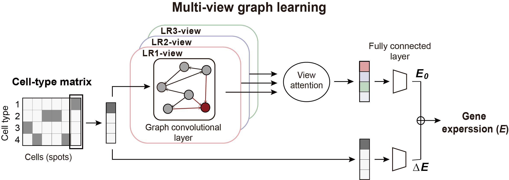
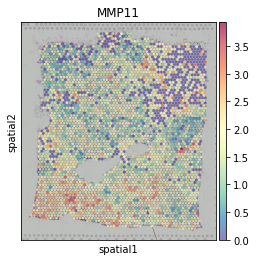
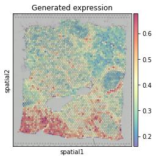
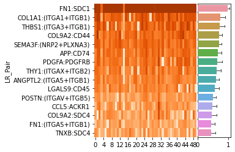
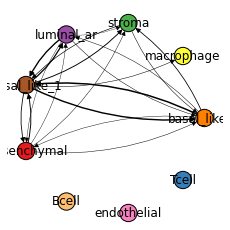
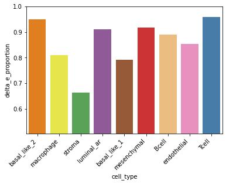
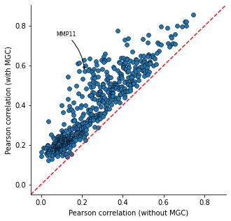
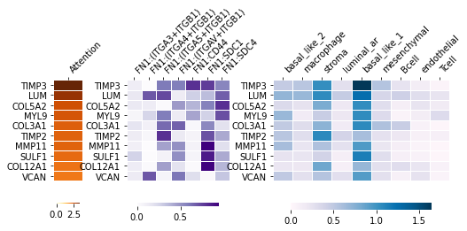

Decoding the holograph of functional cell-cell communication events
==================================================================

Following the first tutorial, in this tutorial, we demonstrate how HoloNet can be used to
decode the holograph of functional cell-cell communication events (FCEs) in spatial transcriptomics data.

For each downstream target gene, HoloNet:

- Identifies cell types serving as major senders
- Identifies ligand–receptor pairs serving as core mediators

in FCEs for specific downstream genes.

.. note::
    The tutorial mainly follows these steps:

    1. Load data and construct multi-view communication event (CE) network
    #. Predict specific target gene expression.
    #. Decode the FCEs for the gene by interpreting the trained model.
    #. Identify genes more affected by cell–cell communication.

.. code:: ipython3

    import HoloNet as hn
    
    import os
    import pandas as pd
    import numpy as np
    import scanpy as sc
    import matplotlib.pyplot as plt
    import torch
    
    import warnings
    warnings.filterwarnings('ignore')
    hn.set_figure_params(tex_fonts=False)
    sc.settings.figdir = './figures/'

Data loading and constructing multi-view CE network
^^^^^^^^^^^^^^^^^^^^^^^^^^^^^^^^^^^^^^^^^^^^^^^^^^^^^^^^^^^

Just like the first tutorial, load the example breast cancer dataset:

.. code:: ipython3

    adata = hn.pp.load_brca_visium_10x()

Load the ligand-receptor (LR) pair database and filter the LR pair:

.. code:: ipython3

    interaction_db, cofactor_db, complex_db = hn.pp.load_lr_df(human_or_mouse='human')
    expressed_lr_df = hn.pp.get_expressed_lr_df(interaction_db, complex_db, adata)
    expressed_lr_df.shape

.. parsed-literal::

    (325, 12)

Just like the first tutorial, we use :func:`HoloNet.tools.default_w_visium` getting a default ``w_best`` value.

Then build multi-view CE network using :func:`HoloNet.tools.compute_ce_tensor` and :func:`HoloNet.tools.filter_ce_tensor`.

.. code:: ipython3

    w_best = hn.tl.default_w_visium(adata)
    elements_expr_df_dict = hn.tl.elements_expr_df_calculate(expressed_lr_df, complex_db, cofactor_db, adata)
    ce_tensor = hn.tl.compute_ce_tensor(expressed_lr_df, w_best, elements_expr_df_dict, adata)
    filtered_ce_tensor = hn.tl.filter_ce_tensor(ce_tensor, adata, expressed_lr_df, elements_expr_df_dict, w_best)

.. parsed-literal::

    100%|██████████| 325/325 [00:30<00:00, 10.74it/s]
    100%|██████████| 325/325 [2:16:41<00:00, 25.24s/it]  

Predicting the target gene expression using a graph model
^^^^^^^^^^^^^^^^^^^^^^^^^^^^^^^^^^^^^^^^^^^^^^^^^^^^^^^^^^^

We construct a multi-view graph learning model to predict the expression of gene on interest.

Selecting the target gene to be predicted
------------------------------------------

Firstly, we select the target genes to be predicted.

The genes with too low, too sparse or too average expression are filtered out.
The filtering parameters can be changed in :func:`HoloNet.predicting.get_gene_expr`.

Then we select *MMP11*, a gene related to tumor invasion as an example target gene.

.. code:: ipython3

    target_all_gene_expr, used_gene_list = hn.pr.get_gene_expr(adata, expressed_lr_df, complex_db)
    
    target = hn.pr.get_one_case_expr(target_all_gene_expr, cases_list=used_gene_list, 
                                     used_case_name='MMP11')
    sc.pl.spatial(adata, color=['MMP11'], cmap='Spectral_r', size=1.4, alpha=0.7)

Getting inputs of the graph model
-----------------------------------

In the multi-view graph learning model, we:

- Use the cell-type matrix as the feature matrix.
- Use normalized multi-view CE network as the adjacency matrix.

Get the feature matrix and adjacency matrix:

.. code:: ipython3

    X, cell_type_names = hn.pr.get_continuous_cell_type_tensor(adata, continuous_cell_type_slot = 'predicted_cell_type',)
    adj = hn.pr.adj_normalize(adj=filtered_ce_tensor, cell_type_tensor=X, only_between_cell_type=True)

If selecting to use categorical cell-type labels,
the feature matrix can be derived from :func:`HoloNet.predicting.get_one_hot_cell_type_tensor`.

Training the graph model
---------------------------

The we train the graph model to predict *MMP11* expression.
If GPU is avaiable, you can set the ``device`` parameter as 'gpu'. Otherwise, we use CPU by default.
The predicted *MMP11* expression pattern are similar to the true pattern.

.. code:: ipython3

    trained_MGC_model_MMP11_list = hn.pr.mgc_repeat_training(X, adj, target, device='gpu')
    predict_result_MMP11 = hn.pl.plot_mgc_result(trained_MGC_model_MMP11_list, adata, X, adj)
    np.corrcoef(predict_result_MMP11.T, target.T)[0,1]

.. parsed-literal::

    100%|██████████| 50/50 [01:51<00:00,  2.23s/it]
    100%|██████████| 50/50 [00:00<00:00, 85.33it/s]

.. parsed-literal::

    0.5677412923581358

If GPU is not available, you can set ``repeat_num`` as a lower number to make the training faster.

.. note::
    The parameters of plotting functions in this tutorials are mainly inherited from two base plotting functions:

    - :func:`HoloNet.plotting.feature_plot`
    - :func:`HoloNet.plotting.cell_type_level_network`

Decode the FCEs for the gene by interpreting the trained model
^^^^^^^^^^^^^^^^^^^^^^^^^^^^^^^^^^^^^^^^^^^^^^^^^^^^^^^^^^^^^^^^^

After training the graph model and find the predicted expression profile similar to the true one,
we can interprete the trained model to reveal the holography of FCEs.

For each target gene, there are three main output figure:

+ LR rank
    - Identify ligand–receptor (LR) pairs serving as core mediators in FCEs for the target gene.
+ Cell-type-level FCE network
    - Identifies cell types serving as major senders
    - The cell-type-level FCE network can be LR-pair-specific or general.
+ Delta E proportion in each cell-type
    - Identify target gene expression in which cell-types are more dominated by FCEs.

LR rank
---------

Plot the top 15 LR pairs (15 can be changed using ``plot_lr_num`` parameter) with the highest view attention weights
The heatmap displays the attention weights of each view obtained from repeated training for 50 times.
The bar plot represents the mean values of the attention weights of each view.

.. code:: ipython3

    ranked_LR_df_for_MMP11 = hn.pl.lr_rank_in_mgc(trained_MGC_model_MMP11_list, expressed_lr_df,
                                                  plot_cluster=False, repeat_attention_scale=True)

If you want plot the LR-pair clustering results in the LR rank plot, you can set ``cluster_col=True``
and provide clustering results in ``expressed_LR_df``.

LR pair clustering can see the first tutorial and :func:`HoloNet.tools.cluster_lr_based_on_ce`.

Cell-type-level FCE network
------------------------------

Cell-type-level POSTN:PTK7 FCE network for *MMP11*.
The thickness of the edge represents the strength of POSTN:PTK7 FCEs between the two cell types.
The network are derived from interpreting the graph convolutional layer.

In the plot, you can focus on one cell-type and look the edges targeted on it,
in order to identify which cell-types are the major sender for it.

.. code:: ipython3

    _ = hn.pl.fce_cell_type_network_plot(trained_MGC_model_MMP11_list, expressed_lr_df, X, adj,
                                         cell_type_names, plot_lr='FN1:SDC1', edge_thres=0.2,
                                         palette=hn.brca_default_color_celltype,)

.. parsed-literal::

    100%|██████████| 50/50 [00:00<00:00, 732.48it/s]

If ``plot_lr`` is one of the LR pair in the ``expressed_LR_df``,
:func:`HoloNet.plotting.fce_cell_type_network_plot` will plot the cell-type-level FCE network for a specific LR pair.
If ``plot_lr='all'``, it will plot the general cell-type-level FCE network for all LR pairs.

Delta E proportion in each cell-type
---------------------------------------

Identify target gene expression in which cell-types are more dominated by FCEs.

The ratio of the expression change caused by CEs (ΔE) to the sum of ΔE
and the baseline MMP11 expression (E0) in each cell type.

.. code:: ipython3

    delta_e = hn.pl.delta_e_proportion(trained_MGC_model_MMP11_list, X, adj,
                                        cell_type_names,
                                        palette = hn.brca_default_color_celltype)

.. parsed-literal::

    100%|██████████| 50/50 [00:16<00:00,  3.12it/s]

Identify genes more affected by cell–cell communication
^^^^^^^^^^^^^^^^^^^^^^^^^^^^^^^^^^^^^^^^^^^^^^^^^^^^^^^^^^^^^^^^^^^

We train the graph model for all selected target genes.
(:func:`HoloNet.predicting.get_gene_expr` select target gene to be predicted)

Comparing with prediction only using cell-type information, the target with higher performance improvement
after considering CEs can be regarded as the genes more affected by cell–cell communication.

.. code:: ipython3

    trained_MGC_model_only_type_list, \
    trained_MGC_model_type_GCN_list = hn.pr.mgc_training_for_multiple_targets(X, adj, target_all_gene_expr, device='gpu')

.. parsed-literal::

    100%|██████████| 586/586 [2:26:12<00:00, 14.97s/it]  

.. note::
    The training process will take a lot of time, you can select to:
        - Change the parameters in :func:`HoloNet.predicting.get_gene_expr` to obtain less target genes to be predicted.
        - Use :func:`HoloNet.predicting.save_model_list` in the next section to save the trained model.

Get the predicting results of all target genes:

.. code:: ipython3

    predicted_expr_type_GCN_df = hn.pr.get_mgc_result_for_multiple_targets(trained_MGC_model_type_GCN_list,
                                                                            X, adj,
                                                                            used_gene_list, adata)
    predicted_expr_only_type_df = hn.pr.get_mgc_result_for_multiple_targets(trained_MGC_model_only_type_list, 
                                                                            X, adj,
                                                                            used_gene_list, adata)

.. parsed-literal::

    100%|██████████| 586/586 [03:56<00:00,  2.47it/s]
    100%|██████████| 586/586 [03:10<00:00,  3.07it/s]

Calculate the Pearson correlation between the predicted expression and the true expression.
Compare the correlation from model only using cell-type information and the ones from HoloNet.

The head target genes in ``only_type_vs_GCN_all`` table are the genes more affected by cell–cell communication.
Gene Ontology (GO) enrichment can be implemented based on the table.

.. code:: ipython3

    only_type_vs_GCN_all = hn.pl.find_genes_linked_to_ce(predicted_expr_type_GCN_df,
                                                         predicted_expr_only_type_df, 
                                                         used_gene_list, target_all_gene_expr, 
                                                         plot_gene_list = ['MMP11'], linewidths=0.5)

.. code:: ipython3

    only_type_vs_GCN_all.head(15)

.. raw:: html

    

    
    <table border="1" class="dataframe">
      <thead>
        <tr style="text-align: right;">
          <th></th>
          <th>only_cell_type</th>
          <th>cell_type_and_MGC</th>
          <th>difference</th>
        </tr>
      </thead>
      <tbody>
        <tr>
          <th>FCGRT</th>
          <td>0.178424</td>
          <td>0.612185</td>
          <td>0.433761</td>
        </tr>
        <tr>
          <th>DEGS1</th>
          <td>0.185925</td>
          <td>0.613490</td>
          <td>0.427565</td>
        </tr>
        <tr>
          <th>SNCG</th>
          <td>0.210716</td>
          <td>0.629114</td>
          <td>0.418398</td>
        </tr>
        <tr>
          <th>IGHE</th>
          <td>0.132936</td>
          <td>0.542906</td>
          <td>0.409970</td>
        </tr>
        <tr>
          <th>CRISP3</th>
          <td>0.375550</td>
          <td>0.774869</td>
          <td>0.399319</td>
        </tr>
        <tr>
          <th>TTLL12</th>
          <td>0.238718</td>
          <td>0.636000</td>
          <td>0.397282</td>
        </tr>
        <tr>
          <th>IFI27</th>
          <td>0.187237</td>
          <td>0.572950</td>
          <td>0.385713</td>
        </tr>
        <tr>
          <th>ARMT1</th>
          <td>0.216805</td>
          <td>0.598850</td>
          <td>0.382045</td>
        </tr>
        <tr>
          <th>MMP11</th>
          <td>0.212497</td>
          <td>0.571419</td>
          <td>0.358922</td>
        </tr>
        <tr>
          <th>SHISA2</th>
          <td>0.269494</td>
          <td>0.620417</td>
          <td>0.350924</td>
        </tr>
        <tr>
          <th>GNG5</th>
          <td>0.234836</td>
          <td>0.582783</td>
          <td>0.347947</td>
        </tr>
        <tr>
          <th>CCND1</th>
          <td>0.314103</td>
          <td>0.661461</td>
          <td>0.347359</td>
        </tr>
        <tr>
          <th>PFKFB3</th>
          <td>0.137106</td>
          <td>0.483999</td>
          <td>0.346892</td>
        </tr>
        <tr>
          <th>CST1</th>
          <td>0.230619</td>
          <td>0.575966</td>
          <td>0.345347</td>
        </tr>
        <tr>
          <th>S100A11</th>
          <td>0.305574</td>
          <td>0.644863</td>
          <td>0.339288</td>
        </tr>
      </tbody>
    </table>
    

Detecting genes related specific pathways
-------------------------------------------

Heatmaps for FN1 pathway related genes, and which ligand receptors affect these genes,
and these FCEs come from which cell types.

.. code:: ipython3

    _ = hn.pl.detect_pathway_related_genes(trained_MGC_model_type_GCN_list,
                                           expressed_lr_df,
                                           used_gene_list,
                                           X, adj, cell_type_names,
                                           pathway_oi='FN1',
                                           xticks_position='top')

.. parsed-literal::

    100%|██████████| 586/586 [01:34<00:00,  6.22it/s]

Saving results for each target gene
-------------------------------------------

For each target gene, saving the heatmap for LR pair attention and FCE network for LR pairs.
Also saving a table including all information.

.. code:: ipython3

    all_target_result = hn.pl.save_mgc_interpretation_for_all_target(trained_MGC_model_type_GCN_list_tmp, X, adj,
                                                                     used_genes, expressed_lr_df.reset_index(), cell_type_names,
                                                                     LR_pair_num_per_target=15,
                                                                     heatmap_plot_lr_num=15,
                                                                     edge_thres=0.2, 
                                                                     save_fce_plot=True,
                                                                     palette=hn.brca_default_color_celltype,                        
                                                                     figures_save_folder='./_tmp_save_fig/',
                                                                     project_name='BRCA_all_target_results_tmp')

.. parsed-literal::

    100%|██████████| 586/586 [28:26<00:00,  2.91s/it]

Model saving and loading
^^^^^^^^^^^^^^^^^^^^^^^^^^^^^^^^

Trained model can be saved to avoid repetitive training.
The models will be saved in 'model_save_folder/project_name/gene_name'.
The 'gene_name' are genes in the ``target_gene_name_list``.
For different trained model, you can set different ``project_name``.

.. code:: ipython3

    hn.pr.save_model_list(trained_MGC_model_type_GCN_list, 
                          project_name='BRCA_10x_generating_all_target_gene_type_GCN', 
                          target_gene_name_list=used_gene_list)
    
    hn.pr.save_model_list(trained_MGC_model_only_type_list, 
                          project_name='BRCA_10x_generating_all_target_gene_only_type',
                          target_gene_name_list=used_gene_list)

Setting the ``target_gene_name_list`` as one gene, the trained model for *MMP11* can be saved in the same way.

Model loading. ``used_genes`` are the list of 'gene_name' before.
Note that the order of ``used_genes`` is different from the ``used_gene_list`` before.

.. code:: ipython3

    trained_MGC_model_only_type_list_tmp, \
    used_genes = hn.pr.load_model_list(X, adj, project_name='BRCA_10x_generating_all_target_gene_only_type', 
                                       only_cell_type=True)
    trained_MGC_model_type_GCN_list_tmp, \
    used_genes = hn.pr.load_model_list(X, adj, project_name='BRCA_10x_generating_all_target_gene_type_GCN')

Using the loaded model, you can repeat the results in the previous section.

.. code:: ipython3

    predicted_expr_type_GCN_df_tmp = hn.pr.get_mgc_result_for_multiple_targets(trained_MGC_model_type_GCN_list_tmp,
                                                                            X, adj,
                                                                            used_genes, adata)
    predicted_expr_only_type_df_tmp = hn.pr.get_mgc_result_for_multiple_targets(trained_MGC_model_only_type_list_tmp, 
                                                                            X, adj,
                                                                            used_genes, adata)

.. parsed-literal::

    100%|██████████| 586/586 [04:05<00:00,  2.38it/s]
    100%|██████████| 586/586 [03:37<00:00,  2.69it/s]

.. code:: ipython3

    only_type_vs_GCN_all2 = hn.pl.find_genes_linked_to_ce(predicted_expr_type_GCN_df_tmp.loc[:,used_gene_list],
                                                         predicted_expr_only_type_df_tmp.loc[:,used_gene_list], 
                                                         used_gene_list, target_all_gene_expr, 
                                                         plot_gene_list = ['MMP11'], linewidths=0.5)

