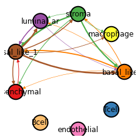

FCE visualization
============

.. code:: ipython3

    import HoloNet as hn
    
    import os
    import pandas as pd
    import numpy as np
    import scanpy as sc
    import matplotlib.pyplot as plt
    import torch
    
    import warnings
    warnings.filterwarnings('ignore')
    hn.set_figure_params(tex_fonts=False)
    sc.settings.figdir = './figures/'

.. code:: ipython3

    adata = hn.pp.load_brca_visium_10x()

.. code:: ipython3

    LR_df = hn.pp.load_lr_df()
    expressed_LR_df = hn.pp.get_expressed_lr_df(LR_df, adata, expressed_proportion=0.3)
    expressed_LR_df.head(3)

.. raw:: html

    

    
    <table border="1" class="dataframe">
      <thead>
        <tr style="text-align: right;">
          <th></th>
          <th>Ligand_gene_symbol</th>
          <th>Receptor_gene_symbol</th>
          <th>Ligand_location</th>
          <th>LR_Pair</th>
        </tr>
      </thead>
      <tbody>
        <tr>
          <th>0</th>
          <td>A2M</td>
          <td>LRP1</td>
          <td>secreted</td>
          <td>A2M:LRP1</td>
        </tr>
        <tr>
          <th>1</th>
          <td>ADAM15</td>
          <td>ITGA5</td>
          <td>plasma membrane</td>
          <td>ADAM15:ITGA5</td>
        </tr>
        <tr>
          <th>2</th>
          <td>ADAM15</td>
          <td>ITGAV</td>
          <td>plasma membrane</td>
          <td>ADAM15:ITGAV</td>
        </tr>
      </tbody>
    </table>
    

.. code:: ipython3

    w_best = hn.tl.default_w_visium(adata)
    CE_tensor = hn.tl.compute_ce_tensor(adata, lr_df=expressed_LR_df, w_best=w_best)
    CE_tensor_filtered = hn.tl.filter_ce_tensor(CE_tensor, adata, 
                                                lr_df=expressed_LR_df, w_best=w_best)

.. parsed-literal::

     17%|█▋        | 50/286 [06:14<27:28,  6.98s/it]

.. code:: ipython3

    X, cell_type_names = hn.pr.get_continuous_cell_type_tensor(adata, continuous_cell_type_slot = 'predicted_cell_type',)
    adj = hn.pr.adj_normalize(adj=CE_tensor_filtered, cell_type_tensor=X, only_between_cell_type=True)

.. code:: ipython3

    target_all_gene_expr, used_gene_list = hn.pr.get_gene_expr(adata, expressed_LR_df)
    
    target = hn.pr.get_one_case_expr(target_all_gene_expr, cases_list=used_gene_list, 
                                     used_case_name='MMP11')
    sc.pl.spatial(adata, color=['MMP11'], cmap='Spectral_r', size=1.4, alpha=0.7)

.. code:: ipython3

    trained_MGC_model_MMP11_list = hn.pr.mgc_repeat_training(X, adj, target, device='gpu')
    predict_result_MMP11 = hn.pl.plot_mgc_result(trained_MGC_model_MMP11_list, adata, X, adj)
    np.corrcoef(predict_result_MMP11.T, target.T)[0,1]

.. parsed-literal::

    100%|██████████| 50/50 [01:44<00:00,  2.09s/it]
    100%|██████████| 50/50 [00:00<00:00, 96.14it/s]

.. image:: tutorial_FCE_files/tutorial_FCE_6_1.png

.. parsed-literal::

    0.5655606970605704

.. code:: ipython3

    ranked_LR_df_for_MMP11 = hn.pl.lr_rank_in_mgc(trained_MGC_model_MMP11_list, expressed_LR_df,
                                                  plot_cluster=False, repeat_attention_scale=True)

.. code:: ipython3

    delta_e = hn.pl.delta_e_proportion(trained_MGC_model_MMP11_list, X, adj,
                                        cell_type_names,
                                        palette = hn.brca_default_color_celltype)

.. parsed-literal::

    100%|██████████| 50/50 [00:15<00:00,  3.28it/s]

.. image:: tutorial_FCE_files/tutorial_FCE_8_1.png

.. code:: ipython3

    _ = hn.pl.fce_cell_type_network_plot(trained_MGC_model_MMP11_list, expressed_LR_df, X, adj, 
                                         cell_type_names, plot_lr='POSTN:PTK7', edge_thres=0.2,
                                         palette=hn.brca_default_color_celltype,)

.. parsed-literal::

    100%|██████████| 50/50 [00:00<00:00, 620.49it/s]

.. code:: ipython3

    trained_MGC_model_only_type_list, \
    trained_MGC_model_type_GCN_list = hn.pr.mgc_training_for_multiple_targets(X, adj, target_all_gene_expr, device='gpu')

.. parsed-literal::

      1%|          | 4/567 [01:00<2:18:47, 14.79s/it]

.. code:: ipython3

    predicted_expr_type_GCN_df = hn.pr.get_mgc_result_for_multiple_targets(trained_MGC_model_type_GCN_list,
                                                                            X, adj,
                                                                            used_gene_list, adata)
    predicted_expr_only_type_df = hn.pr.get_mgc_result_for_multiple_targets(trained_MGC_model_only_type_list, 
                                                                            X, adj,
                                                                            used_gene_list, adata)

.. code:: ipython3

    only_type_vs_GCN_all = hn.pl.find_genes_linked_to_ce(predicted_expr_type_GCN_df,
                                                         predicted_expr_only_type_df, 
                                                         used_gene_list, target_all_gene_expr, 
                                                         plot_gene_list = ['MMP11'], linewidths=0.5)

.. image:: tutorial_FCE_files/tutorial_FCE_12_0.png

.. code:: ipython3

    only_type_vs_GCN_all.head(15)

.. raw:: html

    

    
    <table border="1" class="dataframe">
      <thead>
        <tr style="text-align: right;">
          <th></th>
          <th>only_cell_type</th>
          <th>cell_type_and_MGC</th>
          <th>difference</th>
        </tr>
      </thead>
      <tbody>
        <tr>
          <th>FCGRT</th>
          <td>0.178424</td>
          <td>0.621067</td>
          <td>0.442643</td>
        </tr>
        <tr>
          <th>DEGS1</th>
          <td>0.185925</td>
          <td>0.616776</td>
          <td>0.430851</td>
        </tr>
        <tr>
          <th>SNCG</th>
          <td>0.210716</td>
          <td>0.631299</td>
          <td>0.420582</td>
        </tr>
        <tr>
          <th>CRISP3</th>
          <td>0.375550</td>
          <td>0.778199</td>
          <td>0.402649</td>
        </tr>
        <tr>
          <th>IGHE</th>
          <td>0.132936</td>
          <td>0.535040</td>
          <td>0.402104</td>
        </tr>
        <tr>
          <th>IFI27</th>
          <td>0.187237</td>
          <td>0.586251</td>
          <td>0.399014</td>
        </tr>
        <tr>
          <th>TTLL12</th>
          <td>0.238718</td>
          <td>0.634526</td>
          <td>0.395807</td>
        </tr>
        <tr>
          <th>ARMT1</th>
          <td>0.216805</td>
          <td>0.604939</td>
          <td>0.388135</td>
        </tr>
        <tr>
          <th>PFKFB3</th>
          <td>0.137106</td>
          <td>0.500155</td>
          <td>0.363049</td>
        </tr>
        <tr>
          <th>ISG15</th>
          <td>0.170773</td>
          <td>0.533154</td>
          <td>0.362381</td>
        </tr>
        <tr>
          <th>CCND1</th>
          <td>0.314103</td>
          <td>0.671306</td>
          <td>0.357204</td>
        </tr>
        <tr>
          <th>GNG5</th>
          <td>0.234836</td>
          <td>0.588623</td>
          <td>0.353787</td>
        </tr>
        <tr>
          <th>GFRA1</th>
          <td>0.301931</td>
          <td>0.648950</td>
          <td>0.347018</td>
        </tr>
        <tr>
          <th>MMP11</th>
          <td>0.212497</td>
          <td>0.559382</td>
          <td>0.346885</td>
        </tr>
        <tr>
          <th>SHISA2</th>
          <td>0.269494</td>
          <td>0.615550</td>
          <td>0.346057</td>
        </tr>
      </tbody>
    </table>
    

.. code:: ipython3

    hn.pr.save_model_list(trained_MGC_model_type_GCN_list, 
                          project_name='BRCA_10x_generating_all_target_gene_type_GCN', 
                          target_gene_name_list=used_gene_list)
    
    hn.pr.save_model_list(trained_MGC_model_only_type_list, 
                          project_name='BRCA_10x_generating_all_target_gene_only_type',
                          target_gene_name_list=used_gene_list)

.. code:: ipython3

    trained_MGC_model_only_type_list_tmp, \
    used_genes = hn.pr.load_model_list(X, adj, project_name='BRCA_10x_generating_all_target_gene_only_type', 
                                       only_cell_type=True)
    trained_MGC_model_type_GCN_list_tmp, \
    used_genes = hn.pr.load_model_list(X, adj, project_name='BRCA_10x_generating_all_target_gene_type_GCN')

.. code:: ipython3

    predicted_expr_type_GCN_df_tmp = hn.pr.get_mgc_result_for_multiple_targets(trained_MGC_model_type_GCN_list_tmp,
                                                                            X, adj,
                                                                            used_genes, adata)
    predicted_expr_only_type_df_tmp = hn.pr.get_mgc_result_for_multiple_targets(trained_MGC_model_only_type_list_tmp, 
                                                                            X, adj,
                                                                            used_genes, adata)

.. code:: ipython3

    only_type_vs_GCN_all2 = hn.pl.find_genes_linked_to_ce(predicted_expr_type_GCN_df_tmp.loc[:,used_gene_list],
                                                         predicted_expr_only_type_df_tmp.loc[:,used_gene_list], 
                                                         used_gene_list, target_all_gene_expr, 
                                                         plot_gene_list = ['MMP11'], linewidths=0.5)

.. image:: tutorial_FCE_files/tutorial_FCE_17_0.png

